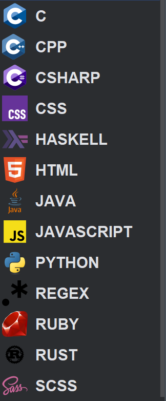
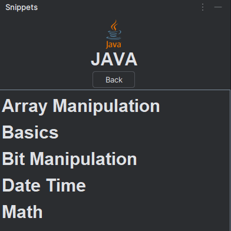
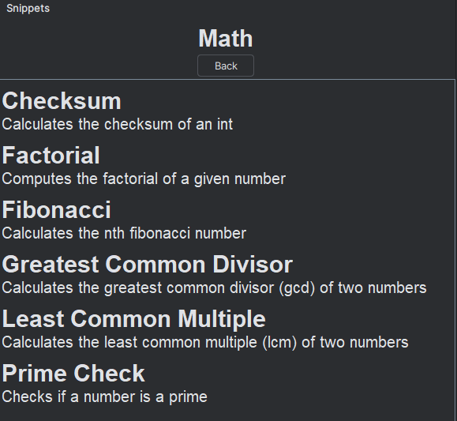
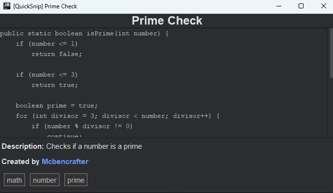

## Overview

This is a JetBrains plugin for viewing snippets from [QuickSnip](https://quicksnip.dev/) directly in JetBrains ideas

## Images





## Running this plugin
1. Clone this repository
2. Open the project in your JetBrains IDE
3. Run the plugin using Gradle:
```shell
./gradlew runIde
```

## Contributing
Contributions are welcome! If you have suggestions or improvements, please fork the repository and submit a pull request.
I'm not the best when it comes to designing things, I'd also love to hear your design ideas! 😊

## TODO
- syntax highlighting in snippets
- sublanguage support
- local snippet saving allowing for offline use
- search feature
- code analysis for snippet suggestions (future idea)

## License
This project is licensed under the MIT License. See the LICENSE file for details.
